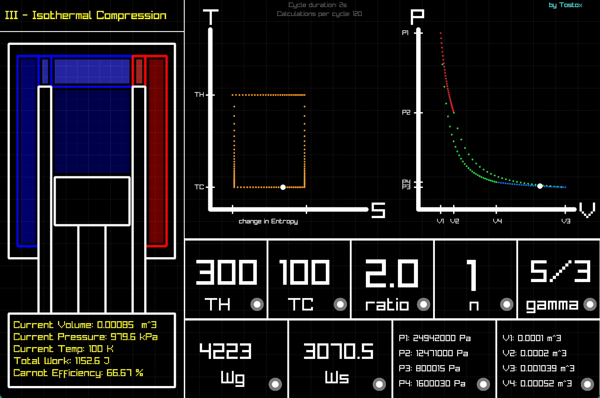

# Carnot_Engine-Cycle_Simulator

The Carnot cycle is the most efficient theoretical heat engine cycle. This simulator lets you explore how temperature, volume, and pressure interact in real-time with:
- 📊 Live PV and TS diagrams
- 🔄 Animated piston showing the cycle
- ⚙️ Real-time parameter adjustment
- 📈 Calculated efficiency and work output

Perfect for physics students, teachers, and anyone curious about thermodynamics!

---

## 🎬 Demo

---

**YOU CAN DOWNLOAD IT (WINDOWS)
[HERE](https://github.com/Tostox70/Carnot_Engine-Cycle_Simulator/releases/download/v1.3/cE_Sim_zipped.zip)**

**FOR MAC DOWNLOAD, GO TO Releases SECTION**

(Full code is under the cE source code)
  

## ✨ Features (v1.3)

- **Real-time Visualization**
  - PV and TS thermodynamic diagrams
  - Animated piston following the Carnot cycle

- **Adjustable Parameters**
  - Hot and cold reservoir temperatures
  - Volume ratios (v1 and v2)
  - Number of moles
  - Heat capacity ratio (γ)
  - Cycle duration

- **Calculations**
  - Total work output
  - Thermal efficiency
  - Real-time computation display
---

## 🎮 How to Use

- Hover over parameters to select them
- Use arrow keys to adjust values
- Spacebar to pause/resume
- Keys 1, 2, 3 to change cycle speed

---

## 🛠️ Tech Stack

- C# (.NET)
- Raylib

---

**FUTURE DEVELOPMENT**

-More features are planned.
  

**CREDITS**

Thanks to AngeTheGreat and AXgamesoft for inspiring me to make this simulator.
  

---

## ☕ Support

Buy me a [coffee](https://ko-fi.com/tostox70)
